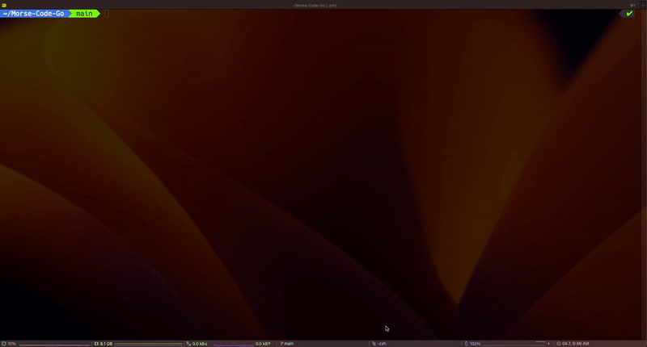
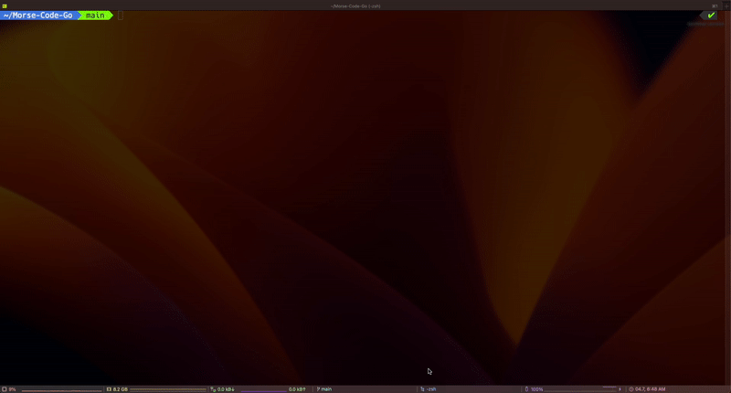
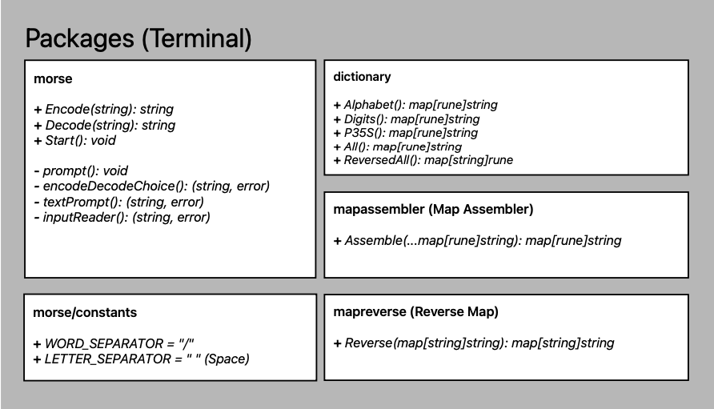
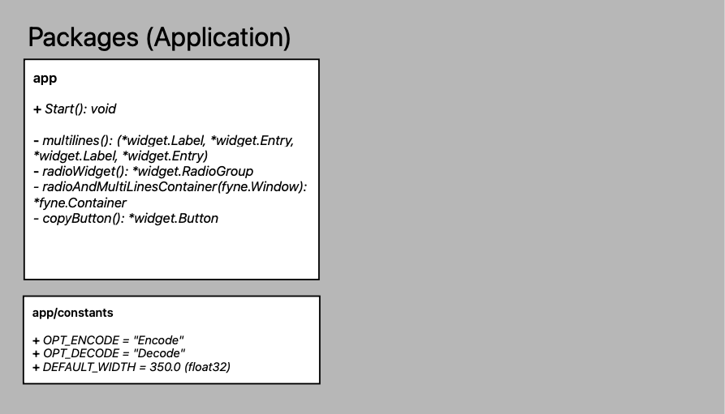
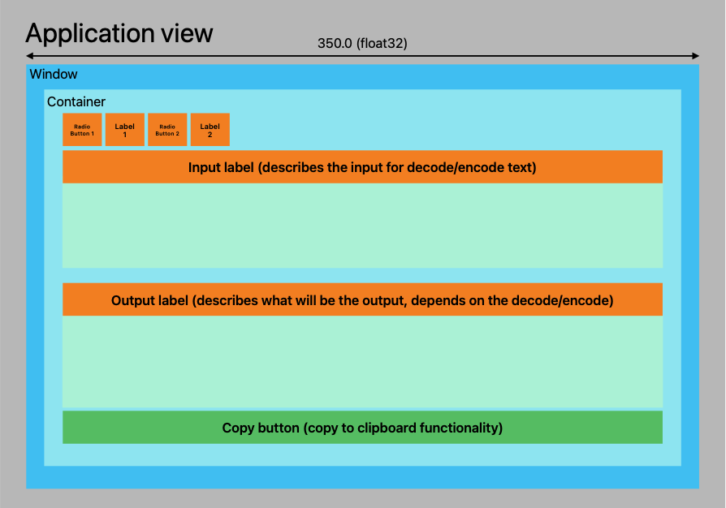

# Morse Code

# Content
- [Content](#content)
- [Introduction](#introduction)
  * [What is Morse Code?](#what-is-morse-code)
  * [The Morse Code (International) table](#the-morse-code-international-table)
- [Terminal version](#terminal-version)
  * [Compiled Terminal version (for three OS)](#compiled-terminal-version-for-three-os)
- [Application version](#application-version)
  * [Compiled Application version folder](#compiled-application-version-folder)
  * [Prerequisites for Application version](#prerequisites-for-application-version)
  * [Further Improvement](#further-improvement)
- [Packages](#packages)
  * [Terminal](#terminal)
  * [Application](#application)
# Introduction

## What is Morse Code?

> ❓ The term Morse Code refers to either of two systems for representing letters of the alphabet, numerals, and punctuation marks by an arrangement of dots, dashes, and spaces. The codes are transmitted as electrical pulses of varied lengths or analogous mechanical or visual signals, such as flashing lights. The two systems are the original “American” Morse Code and the later International Morse Code, which became the global standard.
> [Source](https://www.britannica.com/topic/Morse-Code)

## The Morse Code (International) table

[International Morse Code](https://morsecode.world/international/morse2.html)

[ITU-R](https://www.itu.int/dms_pubrec/itu-r/rec/m/R-REC-M.1677-1-200910-I!!PDF-E.pdf)

# Terminal version

## Compiled Terminal version (for three OS)
**/builds/terminals**

# Application version

## Compiled Application version folder
**/builds/Application**

## Prerequisites for Application version

- [Fyne package for desktop application](https://developer.fyne.io/)

## Further Improvement

[Are in the issues or in the GitHub projects.](https://github.com/users/StarLightNova/projects/2)

# Packages

## Terminal

## Application

